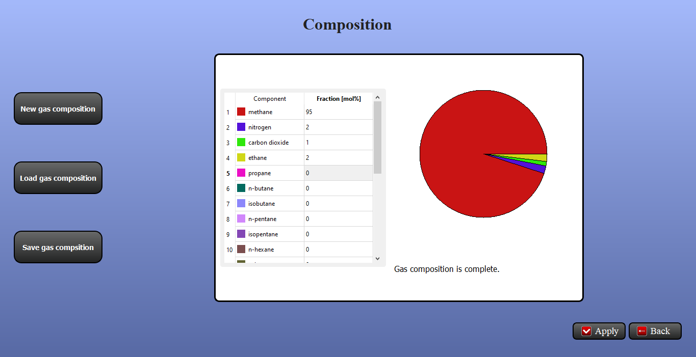

Tutorial
========

GasPropertyCalculator is a package for thermodynamic calculations of properties 
of gas compositions according to the GERG 2008 equation of state.

GasPropertyCalculator can be started from Anaconda prompt by

.. code:: bash

    gaspropertycalculator

or from Python prompt by

.. code:: python

    >>> import gaspropertycalculator
    >>> gaspropertycalculator.gaspropertycalculator.run()

When starting GasPropertyCalculator, the main menu is displayed as shown in Figure 1.

    Figure 1: Main menu of GasPropertyCalculator.

It contains the following submenus:

* **Composition**: Defne a new gas composition, load an existing gas composition from file or save the gas composition to a file.
* **Properties**: Calculation of various properties of the given gas composition.
* **Diagrams**: Visualize temperature and pressure dependencies of the properties of the given gas composition as well as calculation of the enthalpy-entropy diagram.
* **Settings**: Choose the global unit system as well as the norm state definition.
* **Info**: Software information.
* **Quit**: Exit GasPropertyCalculator.

The main menu is accessible from each submenu via the button Back.

Composition
-----------

In this submenu (see Figure 2), the composition of a gas mixture can be defined
by specifying the molar fraction for each gas component. 

In this submenu, the user has the following options:

* **New gas composition**: Clear gas composition.
* **Load gas composition**: Load an existing gas composition from file.
* **Save gas composition**: Save the current gas composition to a file.

    Figure 2: Gas composition submenu after entering an exemplary gas composition.

The pie chart and the status message give feedback about the completeness of the gas
composition.

Using the button **Apply**, the entered gas composition is used for the property
calculations.

Properties
----------

In this submenu, various properties of the given gas mixture can be calculated:

* **Basic properties (e.g. molar mass)**: These properties depend on the gas composition only.
* **Norm state properties (e.g. norm density)**: These properties depend additionally on the norm state definition.
* **Arbitrary state properties (see Figure 3)**: These properties are calculated for a given pressure and temperature on demand using the button **Update**.

    Figure 3: Submenu Properties: Arbitrary State.

Note, that unit conversion between the metric and imperial systems is
possible for each resulting property individually by simply changing the unit
via the respective boxes.

Diagrams
--------

In this submenu, the temperature and pressure dependence of the gas composition 
properties (see Figure 4) as well as the enthalpy-entropy diagram (see
Figure 5) can be calculated. In the first case, the desired property can be
selected via a box menu for plotting.

Note, that for a given pressure and temperature range, all properties are
calculated at once using the button Update. Re-calculation of the diagram
via Update is only necessary if the pressure and temperature ranges are
changed or a new gas composition is applied.

    Figure 4: Submenu Diagrams: Properties.

    Figure 5: Submenu Diagrams: enthalpy-entropy chart.

Settings
--------

In this submenu, some selections can be made: the choice of the global unit
system and the norm state definition (see Figure 6).

    Figure 6: Submenu Settings.
